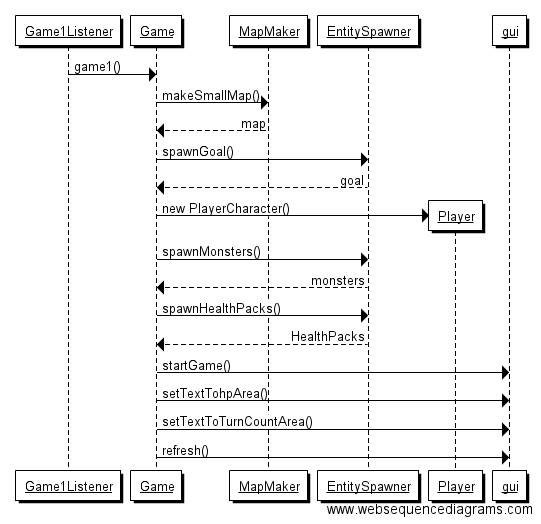

**Aihe**: Luolaryömintäpeli. 
Yhden pelaajan peli, jossa liikutetaan hahmoa neliöistä koostuvalla kentällä, "luolassa". Kenttä sisältää ainakin seiniä ja hirviöitä, sekä jonkinlaisen maalin joka päättää pelin.

**Pelaajan toiminnot**: 
- Hahmon liikuttaminen neljässä suunnassa.
- Peliä ennen asetusten valitseminen.
- Mahdollisesti erilaisten kerättyjen esineiden käyttäminen.

**Luokkakaavio tämänhetkisestä tilanteesta**

  

**Sekvenssikaavioita**  

  

**Rakennekuvaus**
Game-luokka on kaiken ydin ja aivan liian voimakas (pitäisi jakaa osiin). Se kommunikoi kaikkien logiikan osien kanssa, ja suorittaa hahmojen liikuttamiset sekä tallentaa pelin tilaan liittyvän tiedon (Kartta- ja hahmo-objektit). Game kommunikoi GraphicalUIn kanssa, joka taas toimii käyttöliittymän ytimenä. GraphicalUI kerää käyttöliittymän eri osat yhteen ja näyttää ne näytöllä. "Staattisia" luokkia on MapMaker ja Pathfinder, joista ensimmäinen luo erilaisia karttoja pelille ja jälkimmäinen toteuttaa reitinetsinnän hahmoille.
