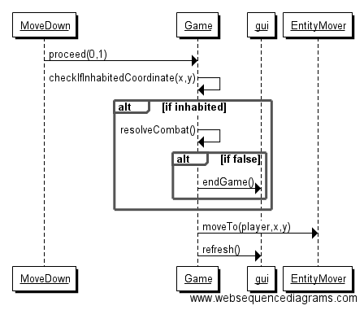

**Aihe**: Luolaryömintäpeli. 
Yhden pelaajan peli, jossa liikutetaan hahmoa neliöistä koostuvalla kentällä, "luolassa". Kenttä sisältää ainakin seiniä ja hirviöitä.

**Pelaajan toiminnot**: 
- Hahmon liikuttaminen neljässä suunnassa.
- Pelityypin valitseminen.

**Luokkakaavio tämänhetkisestä tilanteesta**

  

**Sekvenssikaavioita**  

Pelimoodin valinta  
  
Hahmon liikuttaminen  

kaavioista on jätetty pois asiaan kuulumattomia metodeita

**Rakennekuvaus**
Game-luokka on kaiken ydin. Se kommunikoi käyttöliittymän ja kaikkien logiikkaluokkien kanssa, ja suorittaa vuoron vaihtumiset sekä tallentaa pelin tilaan liittyvän tiedon (Kartta- ja hahmo-objektit). Game kommunikoi GraphicalUIn kanssa, joka taas toimii käyttöliittymän ytimenä. GraphicalUI kerää käyttöliittymän eri osat yhteen ja näyttää ne näytöllä. "Staattisia" luokkia on MapMaker ja Pathfinder, joista ensimmäinen luo erilaisia karttoja pelille ja jälkimmäinen toteuttaa reitinetsinnän hahmoille.
