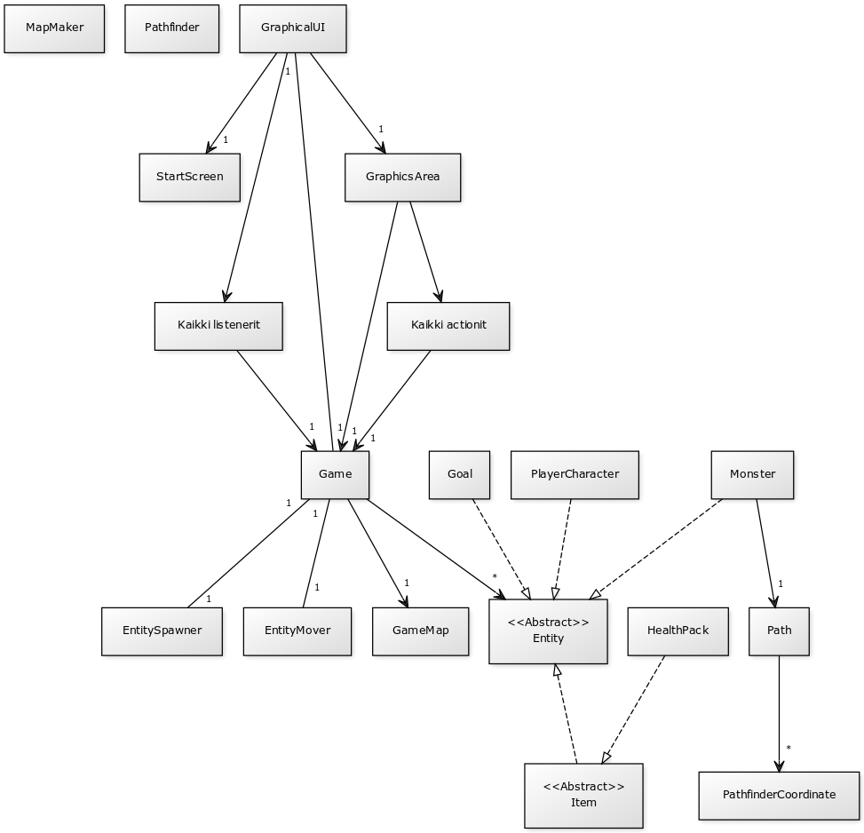

**Aihe**: Luolaryömintäpeli. 
Yhden pelaajan peli, jossa liikutetaan hahmoa neliöistä koostuvalla kentällä, "luolassa". Kenttä sisältää ainakin seiniä ja hirviöitä, sekä jonkinlaisen maalin joka päättää pelin.

**Pelaajan toiminnot**: 
- Hahmon liikuttaminen neljässä suunnassa.
- Peliä ennen asetusten valitseminen.
- Mahdollisesti erilaisten kerättyjen esineiden käyttäminen.

**Luokkakaavio tämänhetkisestä tilanteesta**
